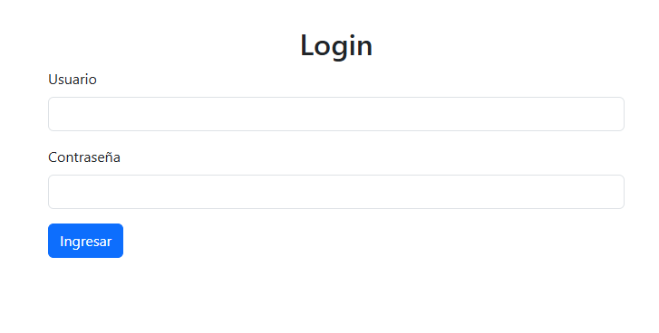
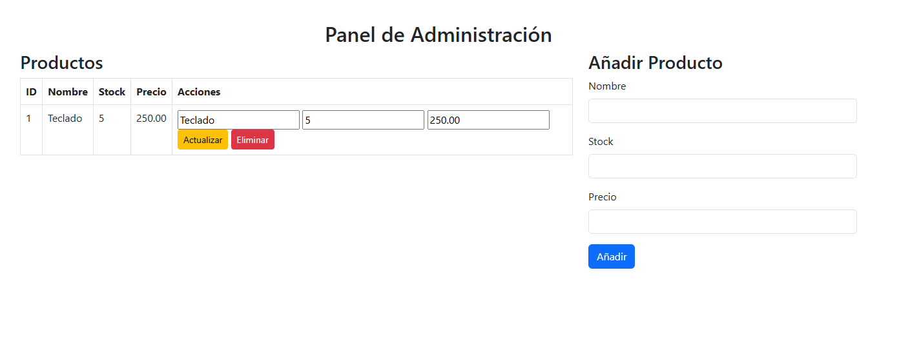
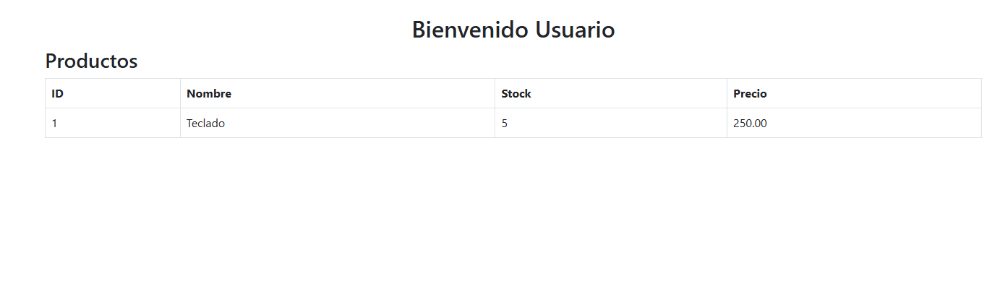

# Actividad-4---Fundamentos-de-construccion-de-software
El proyecto es una aplicación web desarrollada en PHP que permite a los usuarios autenticarse y acceder a diferentes funcionalidades según su rol:

# Sistema de Gestión de Productos en PHP

Este proyecto es una aplicación web desarrollada en PHP que permite gestionar productos en una tienda, con un sistema de autenticación y control de acceso basado en roles. Los usuarios pueden iniciar sesión y acceder a diferentes funcionalidades según su rol: **administrador** o **usuario normal**.

---

## Características Principales

- **Autenticación de Usuarios**:
  - Los usuarios deben iniciar sesión con un nombre de usuario y contraseña.
  - Credenciales predefinidas:
    - Administrador: `admin` / `1234`.
    - Usuario normal: `user` / `1234`.
  - Redirección a diferentes páginas según el rol del usuario.

- **CRUD de Productos (Para Administradores)**:
  - **Crear**: Añadir nuevos productos con nombre, stock y precio.
  - **Leer**: Ver la lista de productos en una tabla.
  - **Actualizar**: Modificar los detalles de un producto existente.
  - **Eliminar**: Borrar productos de la base de datos.

- **Vista de Solo Lectura (Para Usuarios Normales)**:
  - Los usuarios normales pueden ver la lista de productos, pero no tienen permisos para modificarla.

- **Diseño Responsive con Bootstrap**:
  - Interfaz de usuario moderna y adaptable a cualquier dispositivo.

- **Base de Datos MySQL**:
  - Almacena información de usuarios y productos.

---

## Tecnologías Utilizadas

- **PHP**: Lenguaje de programación del lado del servidor.
- **MySQL**: Base de datos para almacenar usuarios y productos.
- **Bootstrap**: Framework de diseño para una interfaz responsive.
- **HTML/CSS**: Estructura y estilos de las páginas web.
- **Sesiones en PHP**: Manejo de autenticación y control de acceso.

---

## Estructura del Proyecto
/tienda
/includes
db.php # Conexión a la base de datos
auth.php # Funciones de autenticación
index.php # Página de inicio (redirección)
login.php # Página de inicio de sesión
admin.php # Panel de administración (CRUD)
user.php # Vista de productos para usuarios normales
logout.php # Cerrar sesión

## Instalación y Uso

1. **Requisitos**:
   - Servidor web (por ejemplo, XAMPP o WAMP).
   - PHP 7.0 o superior.
   - MySQL.

2. **Configuración**:
   - Clona este repositorio en la carpeta de tu servidor web.
   - Importa la base de datos desde el archivo `tienda.sql` (si está disponible).
   - Configura las credenciales de la base de datos en `includes/db.php`.

3. **Ejecución**:
   - Accede a la aplicación desde tu navegador (por ejemplo, `http://localhost/tienda`).
   - Inicia sesión con las credenciales proporcionadas.
  
## Capturas de Pantalla

### Página de Login

### Panel de Administración (Admin)

### Vista de Usuario Normal (User)

  
## Mejoras Futuras

- Implementar **hash de contraseñas** para mayor seguridad.
- Añadir **validación de entradas** en formularios.
- Implementar **paginación** para la lista de productos.
- Añadir funcionalidad de **búsqueda y filtrado** de productos.
- Mejorar el **manejo de errores** y la experiencia del usuario.

## Contacto

Si tienes alguna pregunta o sugerencia, no dudes en contactarme:

- **Nombre**: Edwin Granados
- **Email**: edwin.g08@icloud.com
- **Carnet Galileo**: 25006933
